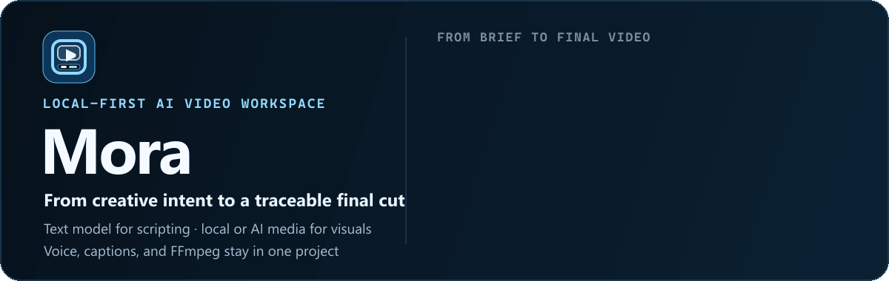
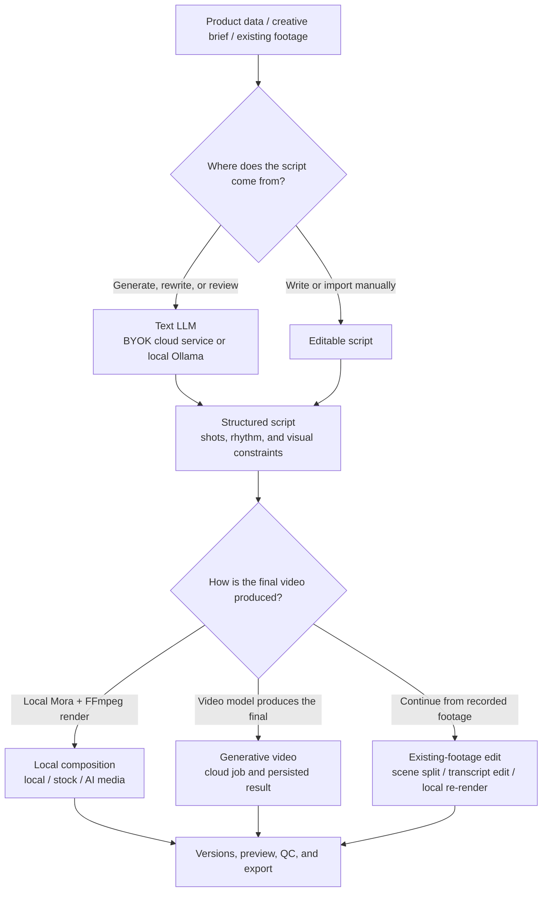
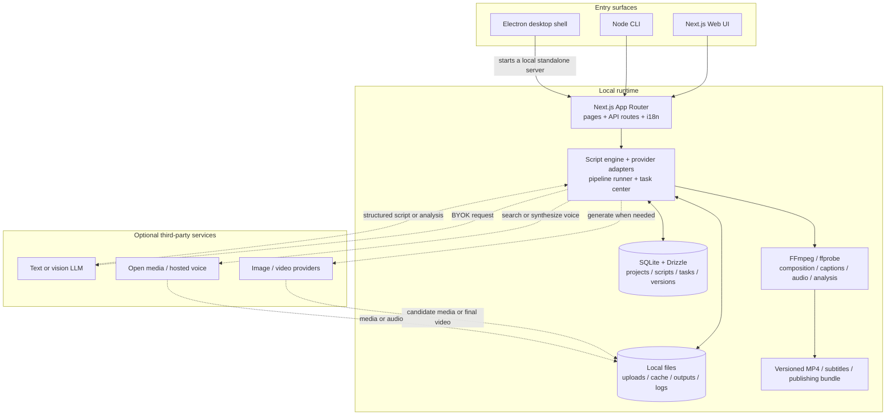

<p align="center">
  
</p>

<p align="center"><a href="./README.md">中文</a> · <strong>English</strong></p>

<h1 align="center">Mora</h1>
<p align="center">(<strong>M</strong>ultimodal <strong>O</strong>rchestration for <strong>R</strong>etail <strong>A</strong>utomation)</p>
<p align="center"><strong>Mora goes beyond isolated generated clips, carrying creative intent into a traceable, recoverable, exportable final video.</strong></p>
<p align="center">A text model handles automatic scripting and storyboards; local media, open libraries, and generated visuals are used as needed; voice, captions, tasks, versions, and FFmpeg composition stay in one project.</p>

<p align="center">
  <a href="#showcase">Real cases</a> ·
  <a href="#workflow">How it works</a> ·
  <a href="#quick-start">Quick start</a> ·
  <a href="#architecture">Architecture</a> ·
  <a href="#desktop">Desktop</a> ·
  <a href="#roadmap">Roadmap</a> ·
  <a href="./README.md">中文</a>
</p>

<p align="center">
  
  
  
  
  
</p>

<a id="showcase"></a>

## Project story: two real starting points

Mora did not begin as an attempt to connect one more video-generation model. It began with two concrete—and fundamentally different—production problems: **how to build a complete product video from a single product image and a short description, and how to preserve already-recorded footage while completing understanding, editing, and delivery locally.**

The first problem lacks usable shots, so models help establish the script, storyboard, and visuals. The second already has the shots; what it lacks is media understanding, pacing, and a reliable post-production path. Mora therefore does not force every project through one “AI generation” pipeline. It first considers the starting media and how the final video will be produced, then selects the appropriate workflow.

The two MP4 files below come from those separate workflows. They share project, script, asset, task, version, and export infrastructure, but their inputs, model responsibilities, and final-video paths are different. Click either board to play the complete video.

### Workflow one: one product image and a short description become a complete product film

Start with the pet-fountain example below: the project begins with just one product image and a brief introduction. A text model expands that limited input into a structured script, shot rhythm, and visual constraints. Generated or reference-conditioned media fills the missing shots, while candidates, script relationships, and the final result return to the same project instead of becoming an untraceable folder of model outputs.

<p align="center">
  <a href="https://sumarilkkxx.github.io/Mora/videos/mora-ai-showcase.mp4"></a>
</p>

<p align="center"><strong>Generative product film · 30.02s · 1080×1920</strong><br><sub>Product image + short description → text script and storyboard → generated shots → complete video version</sub></p>

In this generative workflow, the model is responsible for producing visuals. Mora connects the text script, shot relationships, candidate media, version management, and final composition, turning scattered model outputs into one manageable, deliverable video-production flow.

### Workflow two: existing footage goes through intelligent local editing

Now consider the salon example below: the project begins with an already-recorded vertical video, so there is no need to regenerate the subject. Mora preserves the source, splits scenes, extracts content, restructures the promotional rhythm, creates voice and timed captions, and renders an independent version locally with FFmpeg. The source footage, edit plan, and previous outputs remain intact.

<p align="center">
  <a href="https://sumarilkkxx.github.io/Mora/videos/mora-guided-edit-latest.mp4"></a>
</p>

<p align="center"><strong>Existing-footage edit · 16.4s · local render</strong><br><sub>Source upload → scene split → rhythm edit → voice and captions → local FFmpeg final</sub></p>

This local-editing workflow shows how Mora treats existing media: when usable shots already exist, the system does not regenerate the subject merely to look “AI.” Instead, intelligence helps understand the media, split scenes, organize structure, and assist the edit before the local post-production path produces the complete final video.

These are not two input variants of the same workflow. The first path creates shots when visuals are missing; the second carries existing shots through intelligent local post-production. Together, they define Mora's boundary: **media may come from a camera, a library, or an AI model, but the final video's origin defines the production path.** An AI image can still be ordinary source media. If Mora and FFmpeg render the final MP4, the project remains on a local-final path. Only a final video directly produced by a cloud video model belongs to the generative-video path.

> [!IMPORTANT]
> **A local final does not mean that no model is ever called.** Automatically generating, rewriting, or reviewing a script requires a text LLM. You can bring a key for a cloud OpenAI-compatible service or connect local Ollama. Manually writing, importing, and editing a script can skip that call. Image and video models remain optional and path-dependent; organizing local media, captions, and FFmpeg composition does not require a paid image or video model.

## What Mora is solving

### 1. One project owns the full production context

Scripts, storyboards, product data, media provenance, voice, captions, model jobs, compositions, and exports belong to one project. After a refresh or restart, users see recoverable production state instead of a pile of unrelated temporary results.

### 2. Automation begins with a script, not random visuals

A text model turns selling points, audience, platform, duration, and creative form into a structured script. That script drives media selection, voice length, caption timing, and final rhythm. Users may import or edit every script; model output is not treated as an immutable answer.

### 3. Local work and potentially billable calls stay distinct

Local transcription, scene splitting, captions, FFmpeg composition, and file management are separated from requests to text, image, video, or hosted voice providers. Mora does not collect provider fees or present unknown prices as fake precision.

### 4. Failure state is part of the product

Pipeline stages, cloud jobs, compositions, and failure reasons are persisted. A run can resume from a breakpoint, and completed or potentially billable stages are not accidentally resubmitted after a page refresh.

<a id="workflow"></a>

## How it works: the script is the spine, the final video's origin selects the path



### Path A: local media composition

`Text model or manual script → local/stock/AI image media → voice → captions → BGM → FFmpeg composition → export`

- Use local uploads, project history, and configured open-media sources.
- Voice, burned captions, karaoke timing, BGM, ducking, aspect ratios, and render presets are supported.
- AI images do not automatically turn the project into “generative video.” If Mora renders the final MP4 locally, it remains a local-final path.

### Path B: generative video

`Text script → visual constraints → image/video provider → candidates or cloud final → persist in project → export`

- Pick providers and models independently for images, video, and reference-conditioned generation.
- Capabilities, resolution, aspect ratio, duration, and reference requirements are checked before submission.
- Cloud jobs and local compositions remain separate to prevent origin mistakes and duplicate billable submissions.

### Path C: existing-footage editing

`Upload → scene split/local transcription → rhythm or transcript edit → voice and captions → local render → export`

- Designed for talking-head clips, shop visits, tutorials, interviews, and previously recorded vertical footage.
- Guided editing and transcript-based cuts are both available.
- Source footage, edit plans, and earlier versions stay intact for comparison and rollback.

## Where models participate

| Stage | Required? | Location and behavior |
| --- | --- | --- |
| **Write or import a script manually** | No model | Edited by the user and stored in the project. |
| **Generate, rewrite, or review a script automatically** | Text LLM required | OpenRouter, DeepSeek, Kimi, GLM, MiniMax, Doubao, another OpenAI-compatible service, or local Ollama. |
| **Understand product images** | Optional | Uses a vision-capable model; script generation can still continue from product name and selling points if analysis fails. |
| **Generate new images or video shots** | Optional | Called only when the selected path needs missing visuals. |
| **Voice** | Optional | Edge TTS, provider TTS, existing audio, or a project voice configuration. |
| **Scene splitting, captions, and composition** | No generative model | FFmpeg/ffprobe and the local media pipeline; local transcription can be used when available. |

<a id="quick-start"></a>

## Quick start

### Requirements

- Node.js `20+`
- pnpm `10+`
- Windows 10/11, macOS, or a common Linux development environment
- FFmpeg and ffprobe ship through project dependencies; a separate system install is not required

```bash
git clone https://github.com/sumarilkkxx/Mora.git mora
cd mora
pnpm install
pnpm dev
```

Open [http://localhost:3000](http://localhost:3000). Drizzle applies migrations to `data/sqlite.db` when database-backed features are first used.

### Recommended first run

1. Configure a text script model in Settings. You may skip this if you only plan to import scripts manually.
2. Choose a cloud OpenAI-compatible service and bring your own key, or connect local Ollama at `http://127.0.0.1:11434/v1`.
3. Create a project from product information, a creative brief, or existing footage.
4. Confirm the script before choosing local media, generative shots, or existing-footage editing.
5. Before export, check media rights, provider cost, captions, audio, and platform AIGC-label requirements.

### CLI: start from one topic

The CLI `create` command writes the script automatically, so it requires a text model:

```bash
export MORA_LLM_BASE_URL="https://your-endpoint.example/v1"
export MORA_LLM_API_KEY="your-key"
export MORA_LLM_MODEL="your-model"

pnpm cli -- create --topic "Make better coffee at home" --duration 25 --style lifestyle --karaoke
```

Use `$env:MORA_LLM_BASE_URL=...` in Windows PowerShell. Run `pnpm cli -- --help` for product-link creation, script import, dubbing, platform export, QC, release gates, media credits, covers, and other commands.

### Development checks

```bash
pnpm lint
pnpm test
pnpm build
```

## Capability map

| Stage | Current capabilities |
| --- | --- |
| **Inputs and assets** | Product images and link ingestion, manual product data, creative briefs, video upload, product library, presenter assets, project media |
| **Scripts and storyboards** | Structured fields, text-model scripts, manual scripts, template structures, shot rhythm, script checks, visual descriptions, creative intent, and constraints |
| **Visual media** | Local media plus Pexels, Pixabay, Openverse, Coverr, and other adapters; image generation, image-to-video, reference-to-video |
| **Voice and captions** | Edge TTS, provider TTS, voice and speed, burned captions, karaoke timing, BGM, ducking, subtitle export |
| **Editing and composition** | Scene splitting, structure cloning, transcript editing, camera/look presets, FFmpeg composition, poster extraction, versions |
| **Production management** | Persistent pipelines, resumable state, batches, task center, model preflight, production console, final-video QC |
| **Export and publishing** | Platform presets, preview/download, publishing copy, media credits, AIGC labels, publishing checks |
| **Developer surfaces** | Web UI, HTTP API, zero-dependency Node CLI, Electron shell, SQLite/Drizzle data layer |

## Product surface

<table>
  <tr>
    <th align="center">Creation studio</th>
    <th align="center">Script workspace</th>
    <th align="center">Production console</th>
  </tr>
  <tr>
    <td></td>
    <td></td>
    <td></td>
  </tr>
  <tr>
    <th align="center">Local composer</th>
    <th align="center">Transcript editor</th>
    <th align="center">Task center</th>
  </tr>
  <tr>
    <td></td>
    <td></td>
    <td></td>
  </tr>
</table>

<a id="architecture"></a>

## Architecture

Mora reuses the same Next.js application in Web development and the Electron desktop build. The desktop shell starts a standalone server bound to the local machine and redirects SQLite, uploads, caches, and outputs into the OS user-data directory. FFmpeg and ffprobe are packaged with the application.



### Directory responsibilities

| Path | Responsibility |
| --- | --- |
| `src/app/` | App Router pages, workspaces, and HTTP APIs. |
| `src/lib/script-engine/` | Product/topic prompts, structured generation, and response parsing. |
| `src/lib/providers/` | Image, video, stock-media, and other external-capability adapters. |
| `src/lib/video-composer/` | FFmpeg composition, captions, audio, and media processing. |
| `src/lib/db/`, `drizzle/` | SQLite schema, queries, and migrations. |
| `electron/` | Desktop window, local server, user-data paths, and binary resolution. |
| `bin/mora.mjs` | CLI entry and end-to-end production commands. |

### Persisted production objects

- **Projects** store content type, production path, target duration, and status.
- **Scripts** store structured shots, roles, versions, and the selected variant.
- **Media** stores local files, remote provenance, licensing context, and project ownership.
- **AI jobs and pipelines** store provider jobs, stages, failure reasons, and breakpoints.
- **Compositions and edit plans** store input relationships, render state, output files, and version history.

## Models, media, and cost boundaries

Most configuration lives in Settings; keys do not need to be committed.

| Purpose | Optional integrations |
| --- | --- |
| **Script text models** | OpenRouter, DeepSeek, Kimi, GLM, MiniMax, Doubao, other OpenAI-compatible endpoints, local Ollama |
| **Image/video models** | Atlas Cloud, OpenRouter, Replicate, Volcengine, Alibaba Bailian, SiliconFlow; OpenAI image generation/editing |
| **Open media** | Local media first; optional Pexels, Pixabay, Openverse, Coverr, Jamendo, Freesound, and other sources |
| **Voice and local media** | Edge TTS, provider TTS, project audio, FFmpeg/ffprobe, local transcription capabilities |

Provider keys, balances, regional availability, and content rules remain with each provider. Before starting a potentially billable generation, verify the model, duration, resolution, and current provider price.

## Data boundary and security

- Development data lives under `data/`; packaged desktop data lives in Mora's OS user-data directory.
- SQLite state, uploads, cached media, outputs, and logs remain local by default.
- Script, image, video, stock, and voice requests send the data required for that request to the third-party services you configure.
- Product-link ingestion includes SSRF protection. Login walls, anti-bot systems, regional restrictions, and browser-cookie requirements may prevent backend ingestion.

> [!CAUTION]
> **Mora is open-source software and does not perform rights clearance or platform-compliance review on the user's behalf.** Before publishing or commercial use, users must verify media licenses, likeness rights, trademark use, advertising rules, and platform AIGC-labeling requirements, and remain responsible for the final publication.

<a id="desktop"></a>

## Desktop builds and installers

```bash
# Next.js standalone + Electron directory package
pnpm pack:dir

# Windows x64 NSIS installer
pnpm dist:win

# macOS DMG (run on the matching macOS architecture or CI runner)
pnpm dist:mac
```

GitHub Actions includes Windows x64, macOS Apple Silicon, and macOS Intel build jobs, followed by installer verification and packaged-app smoke tests. During the alpha stage, macOS DMGs may be published as unsigned previews, but they must be clearly labeled as unsigned and unnotarized. On first launch, users may need to approve the app manually in Privacy & Security.

| Version layer | Current convention |
| --- | --- |
| Git tag | `v0.1.0.0` |
| npm / Electron SemVer | `0.1.0` |
| Windows FileVersion | `0.1.0.0` |
| Artifacts | `Mora-Setup-v0.1.0.0-win-x64.exe` / `Mora-v0.1.0.0-mac-<arch>.dmg` |

## HTTP API and automation surfaces

| Surface | Purpose |
| --- | --- |
| `POST /api/llm/script` | Generate and persist a commerce script from product data and text-model configuration. |
| `POST /api/topic/script` | Create a project from one topic and generate several narration scripts. |
| `POST /api/project/:id/compose` | Submit a local composition and return a pollable composition record. |
| `GET /api/tasks` | Aggregate pipeline, render, cloud-generation, and batch task state. |
| `GET /api/health` | Inspect runtime, database migration, and FFmpeg/ffprobe health. |
| `pnpm cli -- --help` | Discover CLI commands from creation and dubbing through QC and publishing checks. |

## Known limitations

`v0.1.0.0` remains an alpha release. The items below describe unstable boundaries in current services and integrations, rather than planned features:

- Login walls, client-side rendering, CAPTCHAs, anti-bot controls, and cookie isolation on Taobao, Tmall, and other marketplaces can prevent product-link ingestion. The reliable fallback today is manual product data or uploaded screenshots.
- Automatic scripting requires a reachable text model. An unavailable endpoint, exhausted quota, or regional restriction can cause generation to fail; fully offline use requires an imported script or local Ollama.
- Model names, parameters, queues, prices, and content policies for image, video, stock-media, and voice services may change, and an adapter may temporarily lag behind a provider update.
- Cloud generation and open-media search depend on network quality, provider rate limits, and task queues. They may time out, be rejected, or arrive late. Mora preserves recoverable state but cannot guarantee third-party availability.

<a id="roadmap"></a>

## Roadmap

This roadmap describes active product directions rather than promised release dates. Priorities may change based on real projects, issues, and contributor feedback.

| Direction | Planned capability and boundary |
| --- | --- |
| **LLM-assisted intelligent editing** | Add scene-semantic understanding, highlight suggestions, pacing alternatives, and explainable edit plans to the existing-footage workflow. Models propose; users can confirm, modify, and roll back. |
| **Compliant product-link ingestion** | Prefer official platform APIs, open interfaces, and user-authorized import methods where platform terms allow them, while retaining manual data, screenshot, and product-library fallbacks. Mora will not attempt to bypass CAPTCHAs, anti-bot controls, or access restrictions. |
| **More resilient provider adapters** | Maintain capability manifests, parameter preflight checks, compatibility tests, and graceful fallbacks to reduce failures after provider changes. |
| **Finer local post-production control** | Expand timeline, caption, voice, BGM, shot replacement, and partial re-render controls so intelligent suggestions remain editable production steps. |
| **Traceable media and publication data** | Improve media provenance, rights records, model-generation history, AIGC-label reminders, and export manifests to support users' own publication checks. |
| **Cross-platform delivery and quality validation** | Continue improving Windows and macOS installers, checksums, update paths, and real-device testing to reduce the gap between source builds and desktop use. |

## FAQ

<details>
<summary><strong>Is local media composition completely offline?</strong></summary>
<br>
Local media, captions, and FFmpeg composition can remain on the machine. Automatic scripting still needs a text model, and Edge TTS or open-media search may access the network. Manual scripts, local Ollama, existing audio, and purely local media minimize external requests.
</details>

<details>
<summary><strong>Does using an AI image make the project an AI-video project?</strong></summary>
<br>
No. Path classification follows the origin of the final video. AI images may be ordinary source media in a local composition. Only a final video generated by a cloud video model belongs to the generative-video path.
</details>

<details>
<summary><strong>Why can Taobao or Tmall product links fail?</strong></summary>
<br>
Backend ingestion does not share login cookies from an external Edge or browser session and must enforce SSRF and private-address protection. Login walls, anti-bot systems, regional restrictions, and client-side rendering may require manual product data or uploaded screenshots.
</details>

<details>
<summary><strong>Does Mora automatically upload the whole project?</strong></summary>
<br>
Mora does not require every project to enter one central cloud. Only the text, image, video, stock, or voice services you explicitly call receive the data needed for that request. The local database and output files remain on the machine.
</details>

## Contributing

1. Start from an existing issue or a small, well-bounded change.
2. Create a focused branch.
3. Add tests for behavior changes and run `pnpm lint && pnpm test && pnpm build`.
4. Explain the user scenario, before/after behavior, verification, and any model-cost, migration, or desktop-packaging impact in the pull request.

Do not commit API keys, user media under `data/`, debug logs, or desktop signing certificates.

## License

Mora is released under the [GNU Affero General Public License v3.0 only](./LICENSE). If you modify Mora and make it available as a network service, understand the AGPL source-availability obligations. Model services, fonts, and media retain their own terms; Mora's AGPL license does not replace them.

---

<p align="center"><strong>Mora</strong><br><sub>Multimodal Orchestration for Retail Automation</sub></p>
