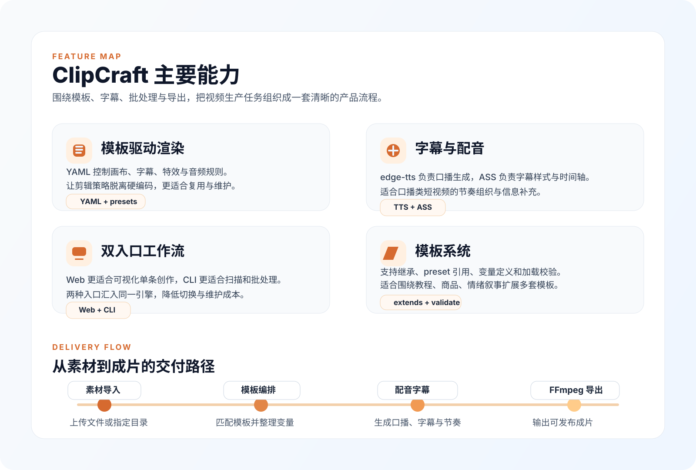
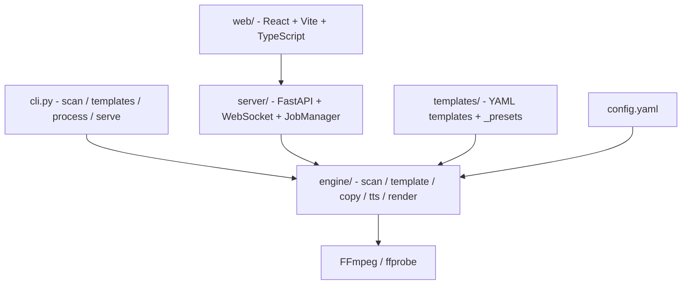

#  ClipCraft

**模板驱动的自动化视频剪辑工作台**，用于把素材上传、模板配置、配音生成、字幕渲染和 FFmpeg 导出串成一条可复用的生产链路。


ClipCraft 采用「**Python 做编排，FFmpeg 做执行**」的结构，提供 **Web 工作台** 与 **CLI** 两种入口，共享同一套 `engine/` 核心引擎与 `templates/` 模板系统。

| 入口 | 适用场景 |
|------|---------|
| **Web 工作台** | 单条视频可视化创作：上传素材、选择模板、填写变量、实时查看进度与结果 |
| **CLI** | 脚本化与批量处理：扫描素材、自动匹配模板、批量渲染、便于后续接入自动化流程 |

---

## 功能特性



### 视频渲染引擎
- **模板驱动的 FFmpeg 渲染**：由 YAML 控制画布、音频、字幕、特效和剪辑行为。
- **自适应慢放与节奏控制**：根据文案与素材时长调整镜头节奏，避免明显冻结帧。
- **画面运动与视觉强化**：支持 Ken Burns、调色、暗角、淡入淡出等效果组合。

### 字幕与配音
- **edge-tts 配音**：输出音频与对应字幕文件，支持不同中文音色与语速配置。
- **ASS 字幕渲染**：模板中定义样式、安全区和换行策略，适合短视频口播场景。
- **BGM ducking**：口播出现时自动压低背景音乐，减轻互相遮挡。

### 模板系统
- **继承与预设**：支持 `extends`、全局模板和 `$preset:` 预设引用。
- **变量化文案**：通过 `copy.variables`、`script_template` 和标题模板生成不同内容版本。
- **模板校验与匹配**：启动前校验模板配置，CLI 批量处理时可按素材特征自动匹配模板。

### 双入口工作流
- **Web 单视频工作台**：适合从上传到导出的完整单条创作流程。
- **CLI 批处理**：适合文件夹级扫描、批量任务调度和自动化执行。

### 内置模板

| 模板 | 适用场景 |
|------|---------|
| `barbershop` | 理发店 / 服务展示 / 叙事型推荐 |
| `product_showcase` | 商品展示 / 电商卖点表达 |
| `tutorial` | 教程讲解 / 步骤拆解 / 知识内容 |
| `emotional_story` | 情绪表达 / 故事叙述 / 品牌氛围内容 |
| `default` | 通用兜底模板 |

---

## 快速开始

### 环境要求

| 依赖 | 说明 |
|------|------|
| **Python ≥ 3.10** | 后端、CLI 与渲染引擎 |
| **Node.js ≥ 18** | Web 前端构建与开发模式 |
| **uv** | `make install` 默认通过 `uv` 创建虚拟环境并安装 Python 依赖 |
| **网络** | `edge-tts` 需要联网；首次自动拉取 bundled FFmpeg 也需要联网 |

> **FFmpeg 无需手动安装**：`engine/ffmpeg_runtime.py` 会优先复用系统 `ffmpeg` / `ffprobe`；若本机不存在，则通过 `static-ffmpeg` 自动下载并缓存当前平台可执行文件。

### 安装

```bash
make install
```

等价手动安装方式：

```bash
uv venv --python 3.11 .venv
uv pip install --python .venv/bin/python -e .
cd web && npm install
```

### 启动 Web 工作台

推荐使用构建后的单体工作台：

```bash
make serve
```

默认地址：

```text
http://127.0.0.1:8000
```

等价命令：

```bash
.venv/bin/python -m server --host 127.0.0.1 --port 8000
# 或
clipcraft serve --port 8000
```

### 开发模式

```bash
make dev
```

开发模式下：
- 后端运行在 `http://127.0.0.1:8000`
- 前端运行在 `http://127.0.0.1:5173`
- Vite 将 `/api` 请求代理到后端

### CLI 示例

```bash
# 扫描素材目录
clipcraft scan --input "/path/to/assets" --detail

# 查看可用模板
clipcraft templates

# 指定模板批量处理
clipcraft process \
  --input "/path/to/assets" \
  --output "/path/to/output" \
  --template product_showcase \
  --voice zh-CN-XiaoxiaoNeural \
  --rate +15% \
  --vars "product_name=云感筋膜枪" "core_feature=深层放松" \
  --workers 4
```

---

## 使用路径

### Web 工作台

当前 Web 端是一个**四步单页工作流**：

1. **素材导入**：上传单个视频文件，服务端写入 `uploads/` 并提取元数据。
2. **模板编排**：从模板卡片中选择策略，或使用智能匹配逻辑。
3. **表达配置**：选择音色、语速，并填写模板变量。
4. **渲染交付**：创建任务，实时接收 WebSocket 进度，并预览输出结果。

Web 前端位于 `web/src/`，当前结构主要分为：
- `api/`：封装 `/api` 请求与类型定义
- `hooks/`：例如 `useJobStream`，负责实时任务状态订阅
- `components/`：工作台组件与基础 UI 组件
- `styles/`：全局样式与设计令牌，如 `global.css`、`tokens.css`

### CLI

CLI 入口位于 `cli.py`，当前包含以下核心命令：

| 命令 | 说明 |
|------|------|
| `clipcraft scan` | 扫描输入路径，输出素材统计与详情 |
| `clipcraft templates` | 列出可用模板与画布信息 |
| `clipcraft process` | 批量创建剪辑任务并执行渲染 |
| `clipcraft serve` | 启动 Web 工作台 |

---

## 系统架构

ClipCraft 的处理链路由双入口汇入同一条后端渲染管线：



### 运行链路

```text
Web 上传 / CLI 输入
  -> 扫描素材与元数据
  -> 加载模板与变量
  -> 生成文案与 TTS
  -> 编译 FFmpeg 命令
  -> 输出成片到 output/<timestamp>/
```

### 分层职责

| 层 | 关键技术 | 职责 |
|----|----------|------|
| 前端 | React 19、Vite、TypeScript、自定义 UI 组件 | 四步工作台、表单配置、预览、状态展示 |
| 服务端 | FastAPI、Uvicorn、WebSocket | 上传、任务创建、实时事件推送、静态资源托管 |
| 引擎 | Python、edge-tts、Jinja2、PyYAML | 扫描、模板加载、文案渲染、配音、批量处理、FFmpeg 编排 |
| 运行时 | static-ffmpeg / 系统 FFmpeg | 实际完成视频与音频处理 |

---

## 项目结构

```text
ClipCraft/
├── engine/
│   ├── batch.py
│   ├── copy_writer.py
│   ├── ffmpeg_renderer.py
│   ├── ffmpeg_runtime.py
│   ├── scanner.py
│   ├── template_loader.py
│   ├── template_matcher.py
│   └── tts.py
├── server/
│   ├── __main__.py
│   ├── app.py
│   ├── jobs.py
│   └── voices.py
├── templates/
│   ├── _presets/
│   ├── _global.yaml
│   ├── barbershop.yaml
│   ├── default.yaml
│   ├── emotional_story.yaml
│   ├── product_showcase.yaml
│   └── tutorial.yaml
├── web/
│   ├── public/
│   └── src/
│       ├── api/
│       ├── components/
│       │   └── ui/
│       ├── hooks/
│       └── styles/
│           ├── global.css
│           └── tokens.css
├── assets/
├── uploads/
├── output/
├── cli.py
├── config.yaml
├── Makefile
├── pyproject.toml
└── README.md
```

### 关键目录说明

| 目录 / 文件 | 作用 |
|-------------|------|
| `engine/` | 核心处理链路，负责素材扫描、文案生成、模板匹配、TTS 与 FFmpeg 渲染 |
| `server/` | Web 服务入口、任务调度、WebSocket 推送与静态托管 |
| `templates/` | YAML 模板库，包含全局模板、业务模板与 `_presets/` 预设 |
| `web/src/` | 前端工作台源码，包含 API 客户端、状态订阅、组件和样式 |
| `config.yaml` | 全局路径、FFmpeg、TTS、批处理和输出模式配置 |
| `uploads/` | Web 上传暂存目录，本地运行产物，默认不提交 |
| `output/` | 默认渲染输出目录，本地运行产物，默认不提交 |

---

## 模板体系

模板目录位于 `templates/`，当前结构由三部分组成：

1. `templates/_global.yaml`
   作为所有模板的共享默认配置，提供画布、音频、字幕、特效等基础参数。
2. `templates/_presets/`
   存放可复用预设，例如调色、字幕样式、转场配置，供模板通过 `$preset:` 引用。
3. 业务模板文件
   如 `barbershop.yaml`、`product_showcase.yaml`、`tutorial.yaml`、`emotional_story.yaml`。

模板加载与校验逻辑位于 `engine/template_loader.py`，主要支持：
- `extends` 继承父模板
- `$preset:` 引用预设片段
- 启动前校验 `canvas`、音量范围、文案变量定义
- 批处理时结合 `template_matcher.py` 做自动匹配

文案渲染逻辑位于 `engine/copy_writer.py`，通过模板中的 `copy` 段生成标题与口播文案。

---

## 配置与 API

### 配置项

编辑 `config.yaml` 可调整以下行为：

| 配置段 | 说明 |
|--------|------|
| `paths` | 模板、素材、临时目录、参考视频目录 |
| `ffmpeg` | 编码器、`crf`、`preset`、音频码率、可选硬件加速 |
| `tts` | 默认音色、默认语速、并发与重试策略 |
| `batch` | 默认并发与模板匹配阈值 |
| `output` | 默认输出模式，当前以 `ffmpeg` 为主 |

### API 概览

所有接口前缀均为 `"/api"`：

| 方法 | 路径 | 说明 |
|------|------|------|
| GET | `/health` | 健康检查 |
| GET | `/config` | 返回默认音色、语速、workers、FFmpeg 可用性等配置 |
| GET | `/voices` | 返回可选 TTS 音色列表 |
| GET | `/templates` | 返回模板摘要列表 |
| GET | `/templates/{name}` | 返回模板详情、变量、画布、匹配规则 |
| POST | `/scan` | 扫描输入路径，返回素材摘要与元数据 |
| POST | `/upload` | 上传单个视频文件到 `uploads/` |
| POST | `/jobs` | 创建渲染任务 |
| GET | `/jobs` | 列出当前任务 |
| GET | `/jobs/{job_id}` | 查看单个任务状态 |
| GET | `/jobs/{job_id}/files/{filename}` | 下载任务输出文件 |
| GET | `/file?path=...` | 预览本地素材文件 |
| WS | `/jobs/{job_id}/ws` | 推送 `snapshot`、`task_update`、`job_completed` 等实时事件 |

---

## 开发说明

### 常用命令

```bash
make help
make install
make build
make serve
make dev
make clean
```

### 本地运行说明

- `uploads/`、`output/` 是本地运行目录，默认不应作为最终交付物提交。
- `web/dist/` 是前端构建产物；开发阶段主要编辑 `web/src/`。
- 如果只想启动 API，也可以直接运行 `python -m server --reload`。

### 路线图

### 近期
- [ ] 参考视频逆向提取模板（场景切点、节奏、转场、语音转写）
- [ ] LLM 智能文案生成与润色
- [ ] 剪映草稿导出（`draft_content.json`）
- [ ] Web 端多视频 / 批量上传与任务列表

### 中期
- [ ] 多段素材编排（A-roll / B-roll）、多模板串联
- [ ] GPU 编码（NVENC / VideoToolbox / QSV）
- [ ] 渲染队列持久化与历史任务

### 长期
- [ ] 素材库与标签系统
- [ ] 同素材多版本 A/B 测试
- [ ] Agent / Skill 封装
- [ ] 插件化特效与配音引擎

---

## 说明

本项目为本地优先工具：素材与成品默认保存在 `uploads/`、`output/`，不会主动上传到云端。若部署到公网环境，请自行补充访问控制、鉴权和磁盘清理策略。
