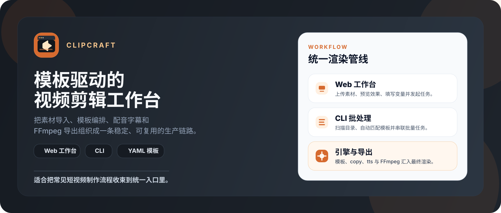

#  ClipCraft

**模板驱动的自动化视频剪辑工作台**，采用「**Python 编排，FFmpeg 执行**」架构，提供 Web 与 CLI 双入口。



---

## 🌟 核心特性

- **模板驱动渲染**：YAML 控制画布、音频、字幕与特效，支持继承与预设。
- **智能文案与配音**：内置 edge-tts 配音与 ASS 字幕渲染，支持变量化文案生成。
- **自适应视频控制**：根据配音与素材时长，自适应调整镜头节奏与画面运动。
- **双入口工作流**：支持 Web 单视频可视化创作，以及 CLI 批量扫描渲染。

---

## 🚀 快速开始

### 1. 环境要求
- **Python ≥ 3.10**
- **Node.js ≥ 18**
- **uv** (推荐，用于 Python 依赖管理)

> *注：FFmpeg 无需手动安装，引擎会自动复用系统环境或拉取静态编译版本。*

### 2. 安装

```bash
make install
```

### 3. 启动 Web 工作台

```bash
make serve
# 访问 http://127.0.0.1:8000
```

*(开发模式请运行 `make dev`)*

### 4. CLI 批处理示例

```bash
# 扫描素材
clipcraft scan --input "/path/to/assets" --detail

# 查看可用模板
clipcraft templates

# 指定模板批量处理
clipcraft process \
  --input "/path/to/assets" \
  --output "/path/to/output" \
  --template product_showcase \
  --voice zh-CN-XiaoxiaoNeural \
  --vars "product_name=云感筋膜枪" "core_feature=深层放松"
```

---

## 📁 项目结构

- `engine/`: 核心引擎（素材扫描、文案生成、模板匹配、TTS 与 FFmpeg 渲染）
- `server/`: FastAPI 后端与 WebSocket 任务流调度
- `web/`: React + Vite 前端可视化工作台
- `templates/`: YAML 业务模板与配置预设库
- `cli.py`: 命令行入口
- `config.yaml`: 引擎全局配置

*(详细的设计思路与接口说明请参考 [DESIGN.md](./DESIGN.md) 与 [PRODUCT.md](./PRODUCT.md))*

---

## 🗺️ 路线图

- [ ] 参考视频逆向提取模板与 LLM 智能文案润色
- [ ] 剪映草稿导出（`draft_content.json`）
- [ ] 多段素材编排与 GPU 硬件编码加速
- [ ] 本地素材库与多版本 A/B 测试支持

---

> **安全说明**：ClipCraft 为本地优先工具，素材与成品默认保存在本地目录。若部署至公网环境，请自行添加访问鉴权与文件清理策略。
