<p align="center">
  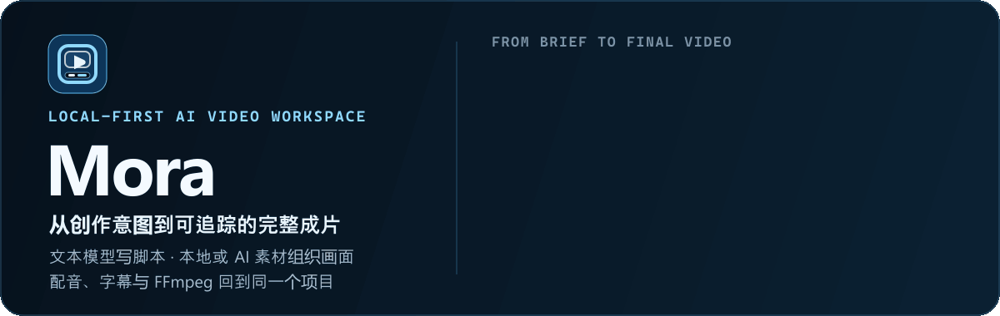
</p>

<p align="center"><strong>中文</strong> · <a href="./README.en.md">English</a></p>

<h1 align="center">Mora</h1>
<p align="center">（<strong>M</strong>ultimodal <strong>O</strong>rchestration for <strong>R</strong>etail <strong>A</strong>utomation）</p>
<p align="center"><strong>本地优先的 AI 视频工作台，从脚本、素材到配音、字幕与成片导出。</strong></p>
<p align="center">用文本模型编写脚本与分镜，组合本地、图库或 AI 素材，在同一个项目中完成制作并管理任务和版本。</p>

<p align="center">
  <a href="#showcase">真实案例</a> ·
  <a href="#workflow">工作方式</a> ·
  <a href="#quick-start">快速开始</a> ·
  <a href="#architecture">技术架构</a> ·
  <a href="#desktop">桌面版</a> ·
  <a href="#roadmap">Roadmap</a> ·
  <a href="./README.en.md">English</a>
</p>

<p align="center">
  
  
  
  
  
</p>

<a id="showcase"></a>

## 项目故事：从商品图片和拍摄原片开始

Mora 最初面向两种制作需求：**用一张商品图片和几句介绍制作商品视频，以及将已经拍好的原片剪辑成适合发布的短片。**

从商品图片开始时，可以用模型编写脚本、规划分镜并生成镜头。已有拍摄原片时，则可以分析素材、调整节奏，再完成配音、字幕和本地合成。

下面是这两种制作方式的案例。点击预览图可播放完整视频。

### 工作流一：一张商品图和简单介绍，生成完整商品短片

宠物饮水机短片以一张商品图片和一段简短介绍为输入。文本模型编写脚本、规划镜头顺序和画面要求，再通过图片或视频生成补齐镜头。脚本、候选素材和成片版本都保存在项目中。

<p align="center">
  <a href="https://sumarilkkxx.github.io/Mora/videos/mora-ai-showcase.mp4">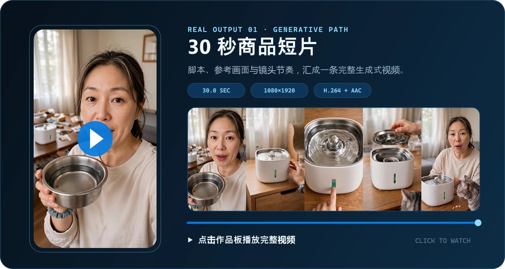</a>
</p>

<p align="center"><strong>生成式商品短片 · 30.02 秒 · 1080×1920</strong><br><sub>商品图片 + 简单介绍 → 文本脚本与分镜 → 生成镜头 → 完整视频版本</sub></p>

### 工作流二：已有拍摄素材，在本地完成智能剪辑

理发店短片以一段已拍摄的竖屏视频为输入。Mora 拆分场景、分析内容，按推广脚本安排镜头，再生成配音和字幕，通过 FFmpeg 在本地渲染。原片、编辑计划和历史成片分别保存，方便比较和重新编辑。

<p align="center">
  <a href="https://sumarilkkxx.github.io/Mora/videos/mora-guided-edit-latest.mp4">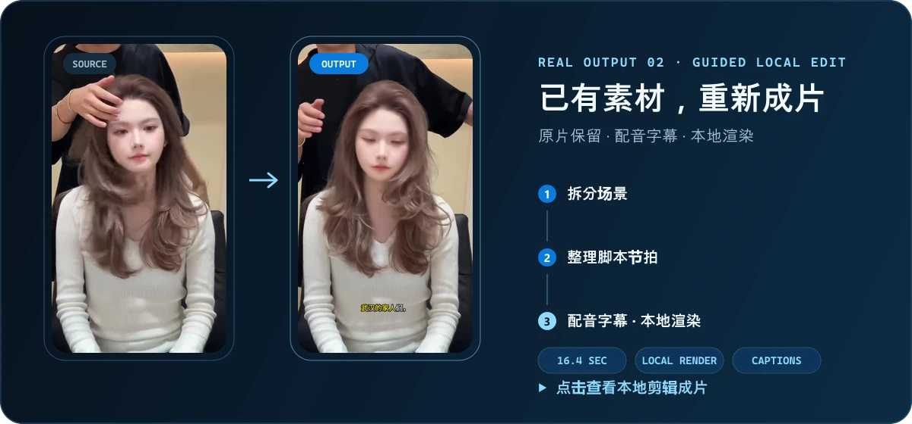</a>
</p>

<p align="center"><strong>已有素材剪辑 · 16.4 秒 · 本地渲染</strong><br><sub>上传原片 → 场景拆分 → 整理节拍 → 配音字幕 → FFmpeg 本地成片</sub></p>

> [!IMPORTANT]
> 自动生成、改写或审查脚本需要文本模型，可连接自带 Key 的云端服务或本机 Ollama。手动编写和导入脚本无需调用模型。各步骤的依赖见[哪些步骤需要模型](#哪些步骤需要模型)，联网要求见[常见问题](#常见问题)。

## Mora 解决什么问题

### 1. 统一管理项目资料与制作进度

脚本、分镜、商品资料、素材来源、配音、字幕、模型任务、合成记录和导出版本保存在同一个项目中，便于查找素材、查看进度和比较版本。

### 2. 按脚本组织视频制作

文本模型根据商品卖点、受众、平台、时长和创作形式编写脚本。脚本用于安排画面、配音长度、字幕时间轴和视频节奏，支持手动编辑和导入。

### 3. 免费本地步骤与可能计费的调用分开

本地转写、场景拆分、字幕、FFmpeg 合成和文件管理，与第三方模型及语音服务的调用分别呈现。模型费用由对应服务商收取，Mora 不代收；具体价格请查看服务商的计费说明。

### 4. 查看失败原因并恢复任务

流水线阶段、云端任务、合成记录和错误原因持续落库。中断后可以从断点继续，已完成且可能计费的步骤不会因为页面刷新被无意重复提交。

<a id="workflow"></a>

## 工作方式

项目按最终视频的制作方式区分路径：Mora 与 FFmpeg 渲染的成片归入本地路径，云端视频模型直接生成的成片归入生成式视频路径。已有原片可以进入专门的剪辑工作流，在本地完成后期。

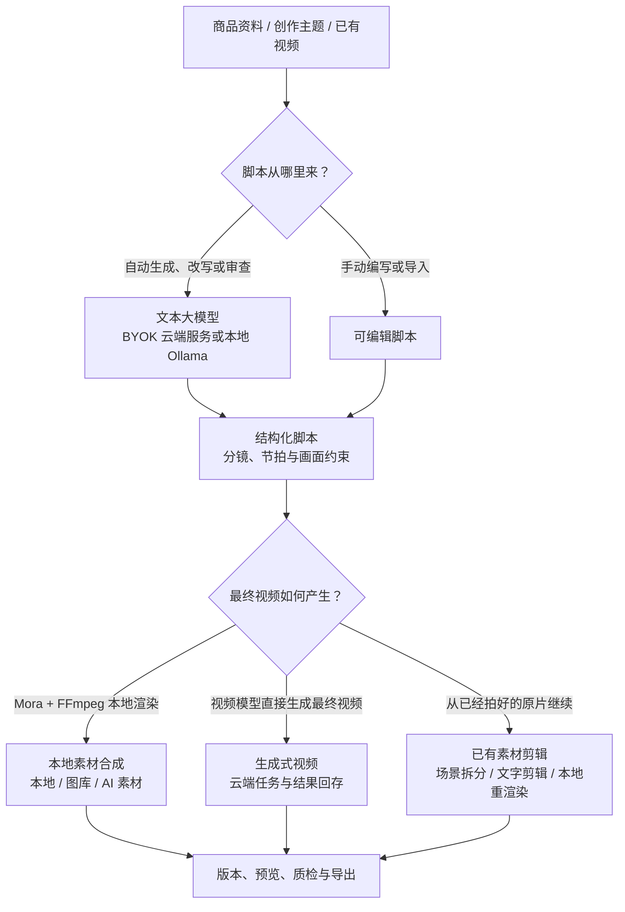

### 路径 A：本地素材合成

`文本模型或手动脚本 → 本地/图库/AI 图片素材 → 配音 → 字幕 → BGM → FFmpeg 合成 → 导出`

- 使用本地上传、项目历史素材和已配置的开放素材源。
- 支持配音、字幕烧录、卡拉 OK、BGM、音量闪避、画幅和渲染预设。
- AI 图片也可作为本地合成的素材。

### 路径 B：生成式视频

`文本脚本 → 视觉约束 → 图片/视频模型 → 候选素材或云端最终视频 → 回存项目 → 导出`

- 图片、视频和参考生能力分别选择平台与模型。
- 请求前检查输入能力、分辨率、比例、时长和参考素材要求。
- 云端任务与本地合成状态分离，避免误判项目来源或重复计费。

### 路径 C：已有素材剪辑

`上传原片 → LLM 理解画面与声音 → 确认推广文案 → 选择剪辑方案 → 配音字幕 → 本地渲染与质检 → 导出`

- 适合口播、探店、课程、访谈和已经拍好的竖屏素材。
- “AI 智能成片”使用视觉大模型理解场景和可见依据，结合商品或服务、目标顾客、卖点和期望行动生成三种推广文案方向；用户可以逐步确认、分段修改或按选填要求重写。
- 确认文案后生成三套可解释的镜头方案，标出系统推荐项，并可查看每个镜头的成片时间、原片区间、文案和画面依据。
- 选定方案后自动完成旁白、中文字幕、FFmpeg 本地剪辑和云端视觉质检；任务、原片、方案与成片版本均可追踪和恢复。
- 同时支持引导式剪辑与基于转写文本的精细删改。
- 原片、编辑计划和历史版本持续保留，方便比较与回退。

## 哪些步骤需要模型

| 阶段 | 是否必需 | 运行位置与说明 |
| --- | --- | --- |
| **手动编写/导入脚本** | 不需要模型 | 完全由用户编辑并保存在项目中。 |
| **自动生成、改写、审查脚本** | 需要文本大模型 | 可使用 OpenRouter、DeepSeek、Kimi、GLM、MiniMax、豆包等 OpenAI 兼容服务，或本机 Ollama。 |
| **商品图片理解** | 按需 | 使用支持视觉输入的模型；失败时脚本仍可根据商品名和卖点继续生成。 |
| **AI 智能剪辑** | 需要文本与视觉大模型 | 视觉模型理解原片场景并复核成片，文本模型生成和审查推广文案；镜头编排、本地转写、配音、字幕与 FFmpeg 渲染由本地工作流执行。 |
| **生成新图片或视频镜头** | 按需 | 只在所选路径缺少画面时调用对应服务商。 |
| **配音** | 按需 | 可使用 Edge TTS、平台 TTS、已有音频或项目音色配置。 |
| **场景拆分、字幕与合成** | 不需要生成模型 | FFmpeg/ffprobe 与本地媒体链路完成；本地转写能力可按环境使用。 |

<a id="quick-start"></a>

## 快速开始

### 环境要求

- Node.js `20+`
- pnpm `10+`
- Windows 10/11、macOS 或常见 Linux 开发环境
- 项目依赖携带 FFmpeg/ffprobe，无需额外安装系统 FFmpeg

```bash
git clone https://github.com/sumarilkkxx/Mora.git mora
cd mora
pnpm install
pnpm dev
```

打开 [http://localhost:3000](http://localhost:3000)。首次访问数据库功能时，Drizzle 会把迁移应用到本地 `data/sqlite.db`。

### 首次使用建议

1. 在“设置”中配置文本脚本模型；如果只打算手动导入脚本，可以暂时跳过。
2. 选择云端 OpenAI 兼容服务并填写自己的 Key，或连接 `http://127.0.0.1:11434/v1` 的本机 Ollama。
3. 从商品资料、创作主题或已有视频创建项目。
4. 确认脚本后再选择本地素材、生成式镜头或已有视频剪辑路径。
5. 在导出前检查素材授权、模型费用、字幕、音量和平台 AIGC 标识要求。

### CLI：从一句主题开始

CLI 的 `create` 命令会自动编写脚本，因此必须提供文本模型：

```bash
export MORA_LLM_BASE_URL="https://your-endpoint.example/v1"
export MORA_LLM_API_KEY="your-key"
export MORA_LLM_MODEL="your-model"

pnpm cli -- create --topic "在家手冲咖啡" --duration 25 --style lifestyle --karaoke
```

Windows PowerShell 使用 `$env:MORA_LLM_BASE_URL=...`。运行 `pnpm cli -- --help` 可查看商品链接、脚本导入、配音译制、平台导出、QC、发布门禁、素材授权清单和封面等命令。

### 开发检查

```bash
pnpm lint
pnpm test
pnpm build
```

## 能力地图

| 阶段 | 当前能力 |
| --- | --- |
| **输入与资产** | 商品图片/链接读取、手动商品资料、创作主题、视频上传、商品库、人物资产、项目素材库 |
| **脚本与分镜** | 结构化字段、文本模型脚本、手动脚本、模板化结构、镜头节拍、脚本检查、分镜描述、创作意图与视觉约束 |
| **画面与素材** | 本地素材、Pexels、Pixabay、Openverse、Coverr 等适配；图片生成、图生视频、参考生视频 |
| **声音与字幕** | Edge TTS、平台 TTS、音色语速、字幕烧录、卡拉 OK、BGM、音量闪避、字幕导出 |
| **编辑与合成** | LLM 智能剪辑、场景理解、推广文案与候选方案、系统推荐、结构复刻、文字剪辑、运镜与 Look、FFmpeg 合成、封面抽帧、版本记录 |
| **生产管理** | 持久化流水线、断点状态、批量制作、任务中心、模型预检、生产控制台、成片质检 |
| **导出与发布** | 多平台规格、预览下载、发布文案包、素材来源记录、AIGC 标识与发布检查 |
| **开发者入口** | Web UI、HTTP API、零依赖 Node CLI、Electron 桌面封装、SQLite/Drizzle 数据层 |

## 产品界面

<table>
  <tr>
    <th align="center">创作台</th>
    <th align="center">脚本工作区</th>
    <th align="center">生产控制台</th>
  </tr>
  <tr>
    <td>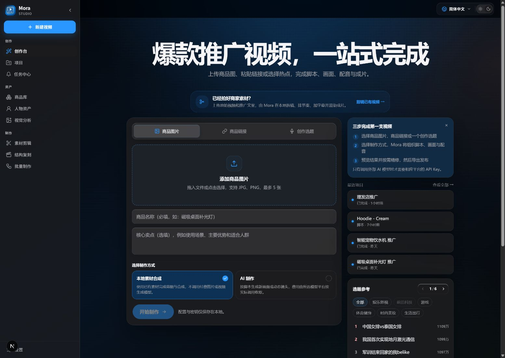</td>
    <td>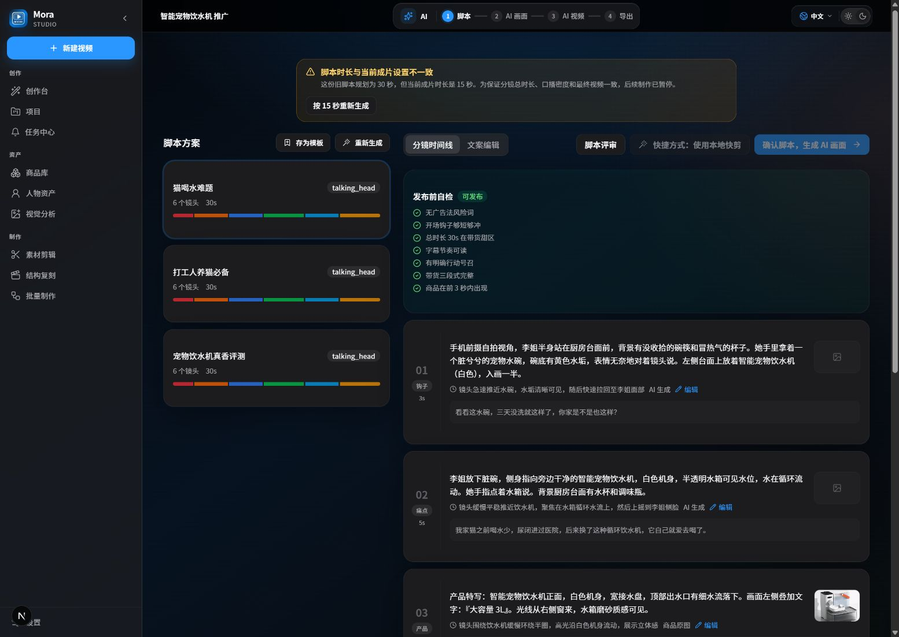</td>
    <td>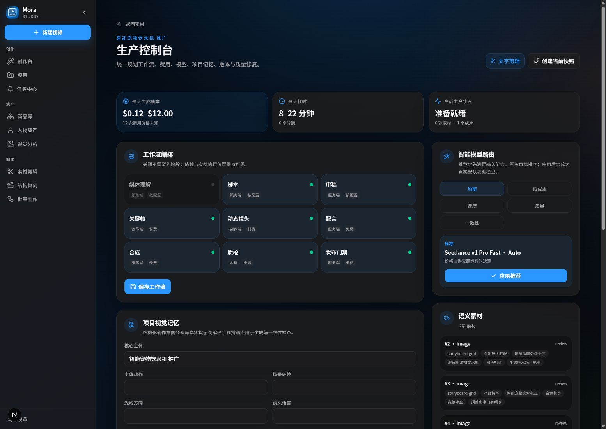</td>
  </tr>
  <tr>
    <th align="center">本地合成</th>
    <th align="center">文字剪辑</th>
    <th align="center">任务中心</th>
  </tr>
  <tr>
    <td>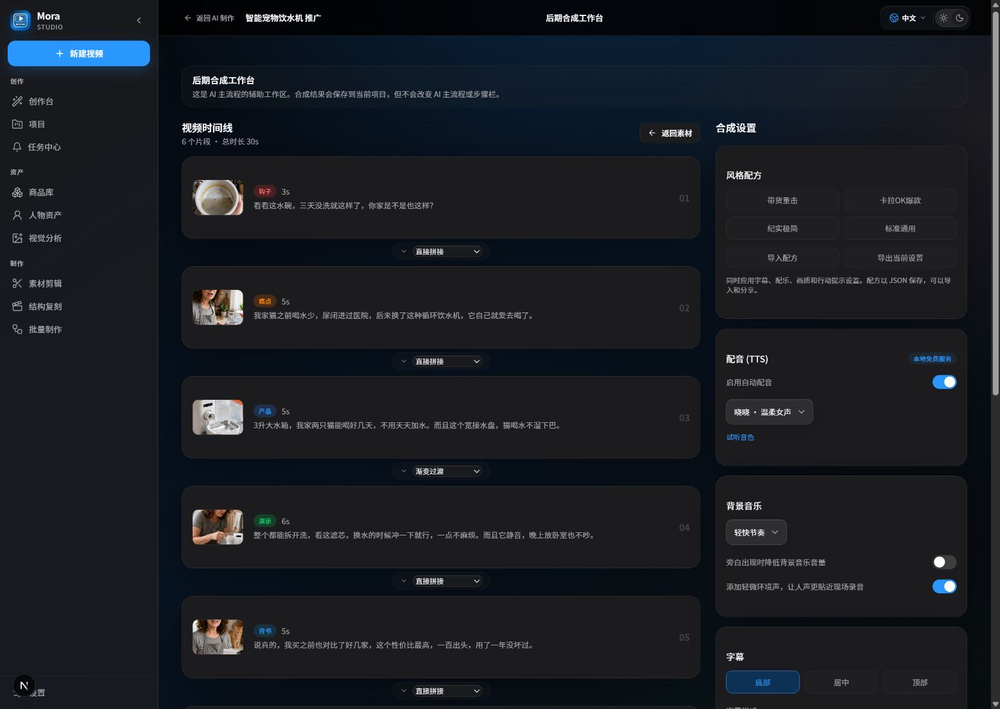</td>
    <td>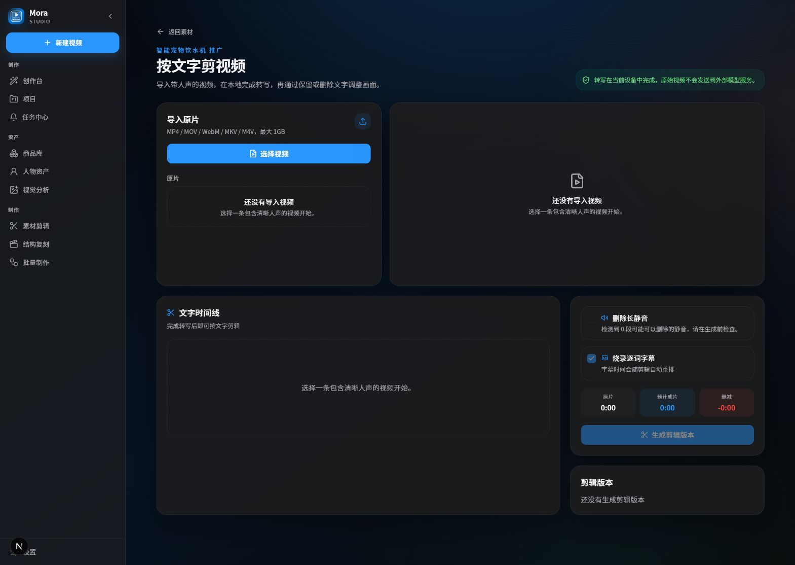</td>
    <td>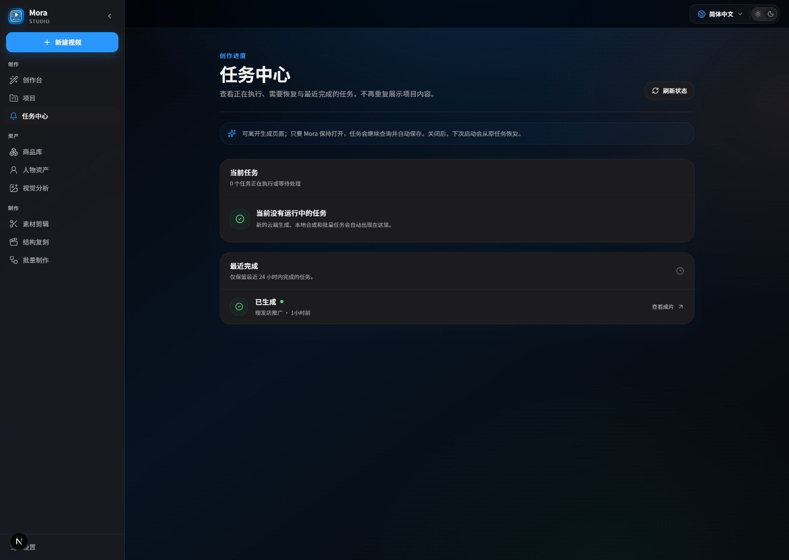</td>
  </tr>
</table>

<a id="architecture"></a>

## 技术架构

Mora 在 Web 开发模式和 Electron 桌面版中复用同一个 Next.js 应用。桌面版会启动一个只监听本机地址的 standalone 服务，并把 SQLite、上传文件、缓存和成片定向到系统用户数据目录；FFmpeg 与 ffprobe 随应用打包。

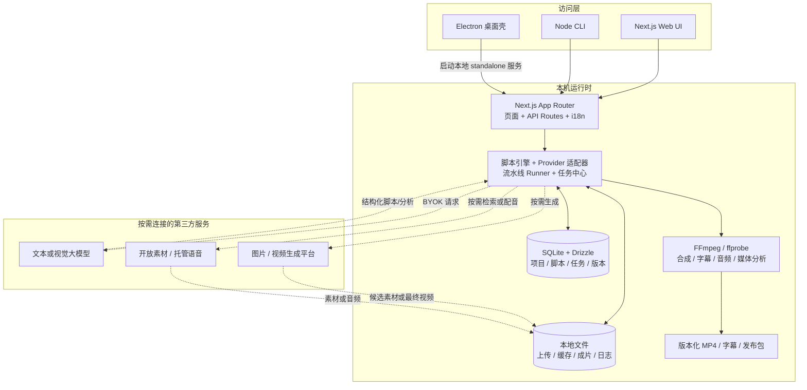

### 目录职责

| 路径 | 职责 |
| --- | --- |
| `src/app/` | App Router 页面、工作区和 HTTP API。 |
| `src/lib/script-engine/` | 商品/主题脚本提示词、结构化生成与解析。 |
| `src/lib/providers/` | 图片、视频、素材和其他外部能力适配器。 |
| `src/lib/video-composer/` | FFmpeg 合成、字幕、音频和媒体处理。 |
| `src/lib/db/`、`drizzle/` | SQLite schema、查询与迁移。 |
| `electron/` | 桌面窗口、本地服务启动、用户数据目录与二进制路径。 |
| `bin/mora.mjs` | CLI 入口与端到端自动制作命令。 |

### 持久化对象

- **项目**保存内容类型、制作路径、目标时长和当前状态。
- **脚本**保存结构化镜头、角色、版本与选中方案。
- **素材**保存本地文件、远程来源、授权信息和项目归属。
- **AI 任务与流水线**保存服务商任务、阶段、失败原因和断点。
- **合成与编辑计划**保存输入关系、渲染状态、输出文件和历史版本。

## 模型、素材与费用

大部分配置在应用“设置”页完成，不要求把 Key 写进仓库。

| 用途 | 可选接入 |
| --- | --- |
| **脚本文本模型** | OpenRouter、DeepSeek、Kimi、GLM、MiniMax、豆包、其他 OpenAI 兼容端点、本机 Ollama |
| **图片/视频模型** | Atlas Cloud、OpenRouter、Replicate、火山引擎、阿里百炼、硅基流动；OpenAI 图片生成与编辑 |
| **开放素材** | 本地素材优先；可选 Pexels、Pixabay、Openverse、Coverr、Jamendo、Freesound 等来源 |
| **语音与本地媒体** | Edge TTS、平台 TTS、项目音频、FFmpeg/ffprobe、本地转写能力 |

密钥、余额、地区可用性和内容规则属于对应平台。执行可能计费的生成任务前，请核对模型、时长、分辨率和服务商实时价格。

## 数据存储与安全

- 开发数据默认位于仓库 `data/`；桌面版位于系统的 Mora 用户数据目录。
- SQLite、上传文件、缓存素材、成片和日志默认保存在本机。
- 调用脚本、图片、视频、素材或语音服务时，必要请求数据会发送给你配置的第三方平台。
- 商品链接读取带 SSRF 防护；登录墙、风控页面、地区限制或依赖浏览器 Cookie 的页面可能无法由后端直接读取。

> [!CAUTION]
> **Mora 是开源软件，不会代替用户完成权利或平台合规审查。** 发布或商用前，用户必须自行确认素材授权、肖像权、商标使用、广告规范及平台 AIGC 标识要求，并对最终发布内容负责。

<a id="desktop"></a>

## 桌面版与安装包

```bash
# Next.js standalone + Electron 目录包
pnpm pack:dir

# Windows x64 NSIS 安装包
pnpm dist:win

# macOS DMG（在对应 macOS 架构或 CI runner 上执行）
pnpm dist:mac
```

GitHub Actions 已配置 Windows x64、macOS Apple Silicon 和 macOS Intel 构建任务，并对最终安装包执行校验和启动冒烟测试。当前 `v0.2.0.0` 的构建配置未启用代码签名，macOS 安装包也未经过公证。首次打开 macOS 应用时，可能需要在“隐私与安全性”中手动允许。

| 版本层 | 当前约定 |
| --- | --- |
| Git 标签 | `v0.2.0.0` |
| npm / Electron SemVer | `0.2.0` |
| Windows FileVersion | `0.2.0.0` |
| 安装包 | `Mora-Setup-v0.2.0.0-win-x64.exe` / `Mora-v0.2.0.0-mac-<arch>.dmg` |

## HTTP API 与自动化入口

| 入口 | 用途 |
| --- | --- |
| `POST /api/llm/script` | 根据商品资料与文本模型配置生成并持久化商业脚本。 |
| `POST /api/topic/script` | 从一句主题创建项目并生成多份旁白脚本。 |
| `POST /api/project/:id/compose` | 提交本地合成并返回可轮询的合成记录。 |
| `POST /api/project/:id/auto-edit` | 创建、推进或恢复 AI 智能剪辑任务，包括素材分析、文案、方案、渲染和导出。 |
| `GET /api/tasks` | 汇总流水线、渲染、云端生成和批量任务状态。 |
| `GET /api/health` | 检查运行时、数据库迁移与 FFmpeg/ffprobe 状态。 |
| `pnpm cli -- --help` | 查看从创建、配音、QC 到发布检查的 CLI 命令。 |

## 当前已知限制

`v0.2.0.0` 为 alpha 版本，目前存在以下限制：

- 淘宝、天猫等电商平台的登录墙、动态渲染、验证码、风控和 Cookie 隔离可能导致商品链接无法解析；当前可靠回退方式是手动填写商品信息或上传商品截图。
- 自动脚本依赖可访问的文本模型；云端端点不可用、额度不足或地区受限时会生成失败，完全离线使用需要手动导入脚本或配置本机 Ollama。
- 图片、视频、素材和语音服务的模型名称、参数、队列、价格及内容策略可能变化，适配器可能暂时落后于服务商更新。
- 云端生成和开放素材检索受网络质量、平台限流及任务排队影响，可能出现超时、拒绝或结果延迟；Mora 会保留可恢复状态，但无法保证第三方服务始终可用。

<a id="roadmap"></a>

## Roadmap

以下功能尚未确定发布日期，优先级会根据使用反馈、Issue 和贡献情况调整。

| 方向 | 计划内容 |
| --- | --- |
| **改进商品链接导入** | 接入平台官方 API、开放接口及平台条款允许的用户授权导入方式，同时保留手动填写资料、上传截图和从商品库导入的选项。 |
| **更稳定的 Provider 适配层** | 建立模型能力清单、参数预检、版本兼容测试和失败降级，减少服务商更新造成的调用中断。 |
| **更细的本地后期控制** | 增强时间轴、字幕、配音、BGM、镜头替换和局部重渲染能力，让智能建议能够落到可编辑的制作步骤。 |
| **可追踪的素材与发布信息** | 完善素材来源、授权记录、模型生成记录、AIGC 标识提示和导出清单，帮助用户在发布前完成自己的合规检查。 |
| **跨平台交付与质量验证** | 持续完善 Windows 与 macOS 安装包、校验文件、升级路径和真实设备测试，降低从源码运行到桌面使用的门槛。 |

## 常见问题

<details>
<summary><strong>本地素材合成是否完全离线？</strong></summary>
<br>
本地素材、字幕和 FFmpeg 合成本身可以留在本机；但自动写脚本需要文本模型，Edge TTS 或开放素材检索也可能访问网络。手动脚本、本机 Ollama、已有音频和纯本地素材可以把外部请求降到最低。
</details>

<details>
<summary><strong>用了 AI 图片，项目就会显示为 AI 视频吗？</strong></summary>
<br>
不会。用 AI 图片作为素材进行本地合成，仍属于本地路径。具体分类见[工作方式](#workflow)。
</details>

<details>
<summary><strong>为什么淘宝或天猫链接可能抓取失败？</strong></summary>
<br>
Mora 的后端抓取服务无法使用你在浏览器中的登录状态。需要登录、验证码或浏览器动态加载的页面可能无法直接解析，平台风控和地区限制也可能影响访问。解析失败时，可以手动填写商品信息或上传截图。
</details>

<details>
<summary><strong>项目数据会自动上传到 Mora 服务器吗？</strong></summary>
<br>
不会自动上传整个项目。本地数据库与输出文件保存在本机；调用第三方文本、图片、视频、素材或语音服务时，会发送完成该请求所需的数据。详见[数据存储与安全](#数据存储与安全)。
</details>

## 参与贡献

1. 从现有问题或一个边界清晰的小改动开始。
2. 新建分支并保持变更聚焦。
3. 为行为修改补充测试，运行 `pnpm lint && pnpm test && pnpm build`。
4. 在 Pull Request 中说明用户场景、前后行为、验证方式，以及是否影响模型费用、数据迁移或桌面打包。

请勿提交 API Key、`data/` 中的用户素材、调试日志或桌面签名证书。

## 许可证

Mora 以 [GNU Affero General Public License v3.0 only](./LICENSE) 发布。如果你修改 Mora 并通过网络向他人提供软件服务，请确认理解 AGPL 的源码提供义务。模型服务、字体和媒体素材仍受各自条款约束，不因项目采用 AGPL 而自动改变。

---

<p align="center"><strong>Mora</strong><br><sub>Multimodal Orchestration for Retail Automation</sub></p>
